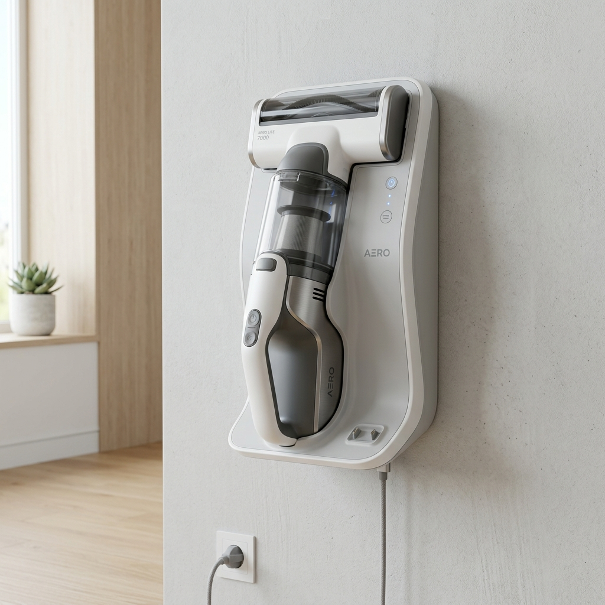

# 2.4 System Overview – Charger

The Charger is a wall-mountable dock providing fast charging capabilities to the Handunit battery pack. It also acts as the physical organization hub, storing additional nozzles and accessories.

---
[« Back to Table of Contents](../README.md)
