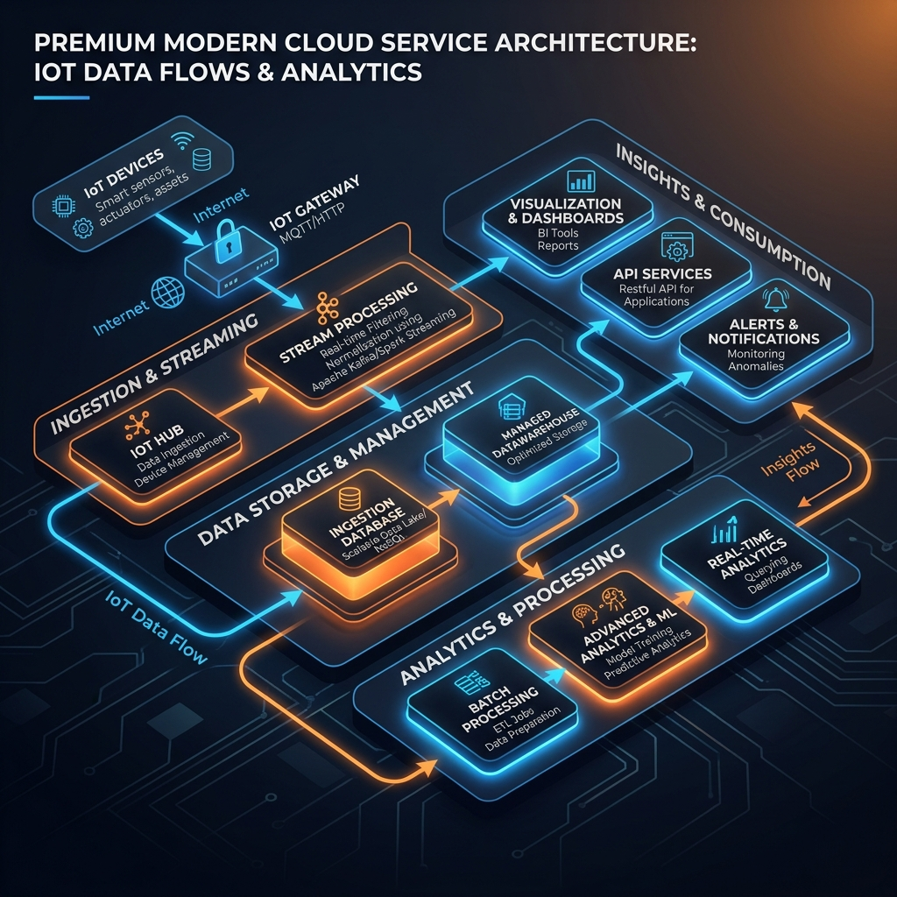

# 2.5 System Overview – Cloud

The Cloud infrastructure facilitates over-the-air (OTA) firmware updates, telemetry logging (such as battery health, usage hours, and diagnostic error codes), and syncs with mobile applications for remote configuration and analysis.

---
[« Back to Table of Contents](../README.md)
