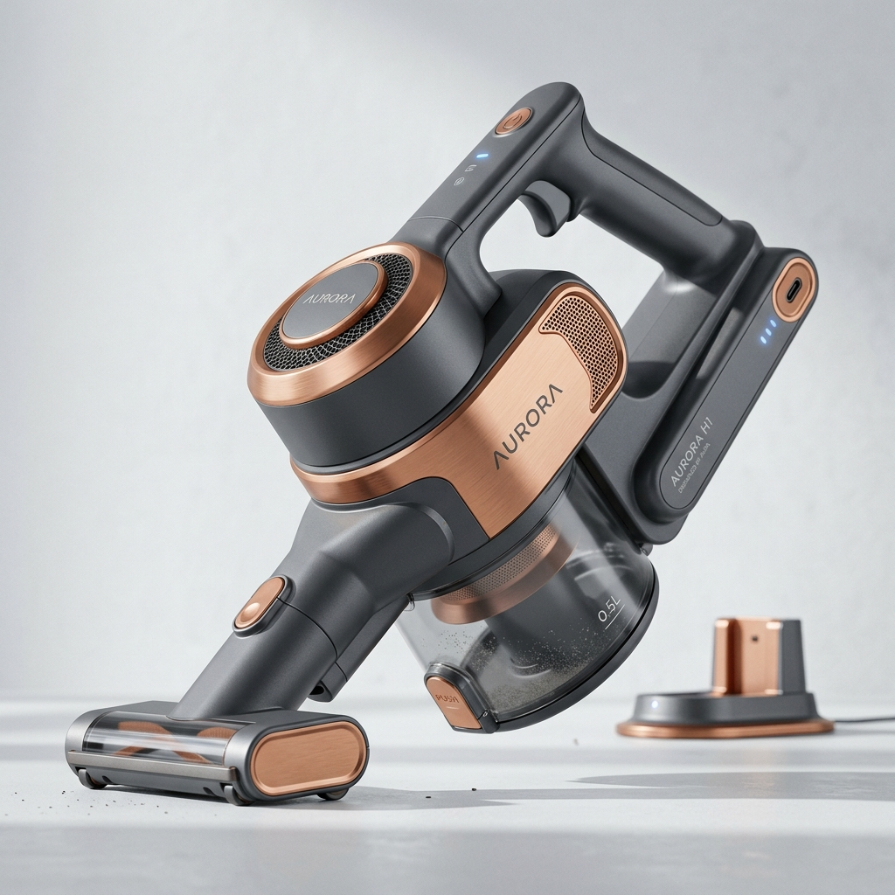

# 2.1 System Overview – Handunit

The Handunit serves as the central core of the modular system. It houses the high-efficiency suction motor, the lithium-ion battery pack, user controls, and the multi-stage cyclonic filtration assembly.

---
[« Back to Table of Contents](../README.md)
