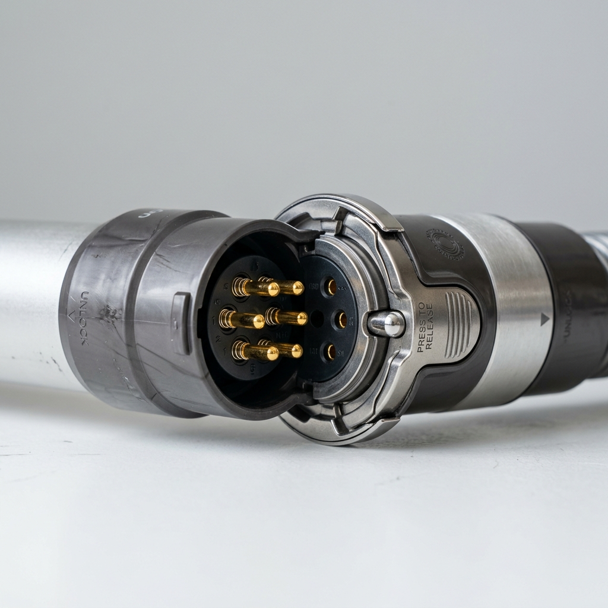

# 2.2 System Overview – Tube

The Tube is a lightweight, durable extension conduit linking the handheld unit to the floor nozzle attachments. It features integrated low-voltage electrical lines to supply power and communications to the motorized nozzles.

---
[« Back to Table of Contents](../README.md)
