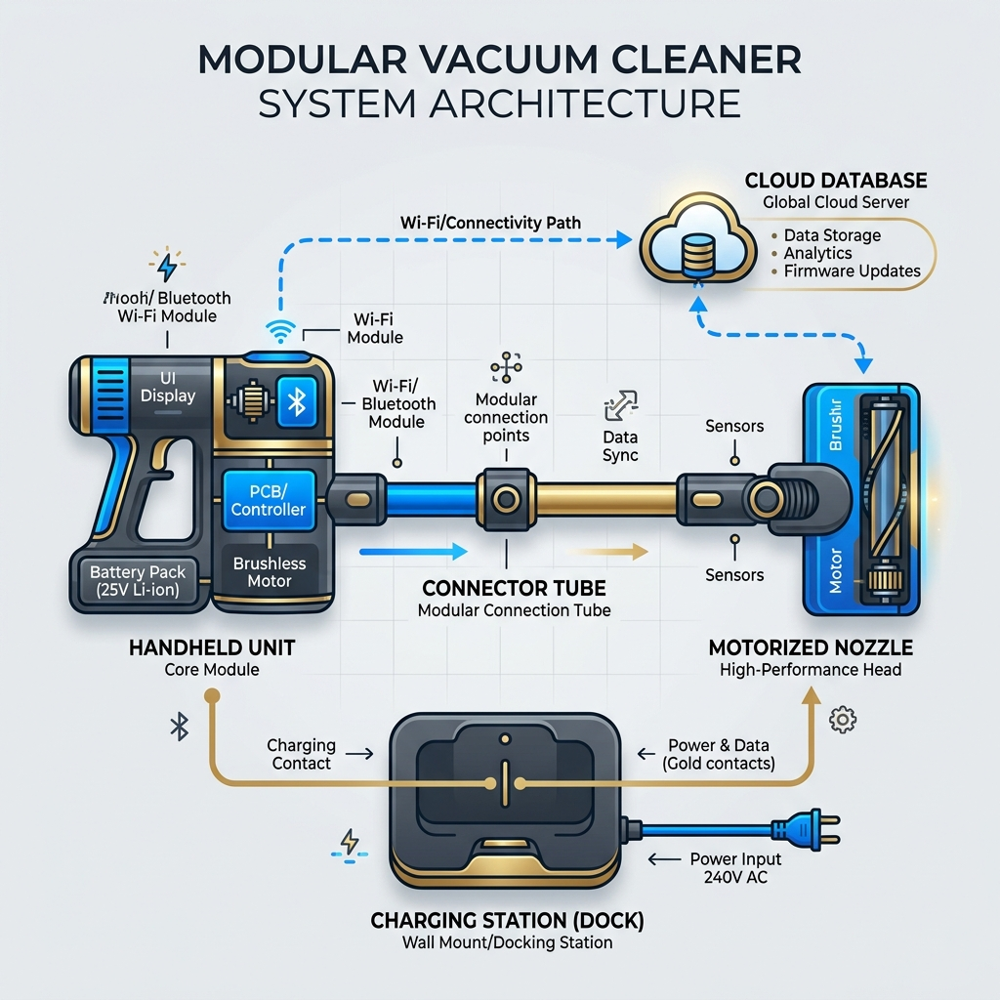

# System Test Plan - Project A1

Welcome to the central landing page and Single Source of Truth (SSoT) for the **Project A1 System Test Plan**. 

This repository implements a modular, inheritance-driven architecture:
* **Global Core Modules (`GLOBAL_*.md`):** Contain generic policies, lab facilities, and definitions shared across all corporate products.
* **Project-Specific Overrides (`A1_*.md`):** Contain specifications, team roles, and system descriptions unique to the A1 project.

---

## 1. System Level Architecture

---

## 2. Test Plan Architecture Map

The diagram below details the structural mapping and inheritance structure of the document files:

---

## 3. Table of Contents

### [1. Introduction](./01_Introduction)
* [1.1 Scope and Purpose](./01_Introduction/A1_Scope_and_Purpose.md)
* [1.2 Abbreviations](./01_Introduction/GLOBAL_Abbreviations.md)
* 1.3 Definitions:
  * [1.3.1 White Box Testing Strategy](./01_Introduction/GLOBAL_White_Box_Testing_Strategy.md)
  * [1.3.2 Black Box Testing Strategy](./01_Introduction/GLOBAL_Black_Box_Testing_Strategy.md)
  * [1.3.3 Functional Testing Definition](./01_Introduction/GLOBAL_Functional_Testing_Definition.md)
  * [1.3.4 Non-Functional Testing Definition](./01_Introduction/GLOBAL_Non_Functional_Testing_Definition.md)

### [2. System Overview](./02_System_Overview)
* [2.1 System Overview – Handunit](./02_System_Overview/A1_System_Overview_Handunit.md)
* [2.2 System Overview – Tube](./02_System_Overview/A1_System_Overview_Tube.md)
* [2.3 System Overview – Nozzle](./02_System_Overview/A1_System_Overview_Nozzle.md)
* [2.4 System Overview – Charger](./02_System_Overview/A1_System_Overview_Charger.md)
* [2.5 System Overview – Cloud](./02_System_Overview/A1_System_Overview_Cloud.md)

### [3. Product Requirements](./03_Product_Requirements)
* [3.1 Requirements and Claims](./03_Product_Requirements/A1_Requirements_and_Claims.md)
* [3.2 User Stories](./03_Product_Requirements/A1_User_Stories.md)
* [3.3 Technical Models](./03_Product_Requirements/A1_Technical_Models.md)

### [4. Test Strategy](./04_Test_Strategy)
* [4.1 Technical Models](./04_Test_Strategy/A1_Technical_Models.md)
* [4.2 Functional Testing Strategy](./04_Test_Strategy/A1_Functional_Testing.md)
* [4.3 Non-Functional Testing Strategy](./04_Test_Strategy/A1_Non_Functional_Testing.md)
* [4.4 Static Testing Strategy](./04_Test_Strategy/GLOBAL_Static_Testing.md)
* [4.5 Goal with the Test](./04_Test_Strategy/A1_Goal_with_the_Test.md)
* [4.6 Item Pass/Fail Criteria](./04_Test_Strategy/GLOBAL_Item_Pass_Fail_Criteria.md)
* 4.7 Entry and Exit Criteria:
  * [4.7.1 Entry Criteria](./04_Test_Strategy/GLOBAL_Entry_Criteria.md)
  * [4.7.2 Exit Criteria](./04_Test_Strategy/GLOBAL_Exit_Criteria.md)
* [4.8 Quality Assurance](./04_Test_Strategy/GLOBAL_Quality_Assurance.md)
* [4.9 Test Deliverables](./04_Test_Strategy/A1_Test_Deliverables.md)
* [4.10 Test Tasks](./04_Test_Strategy/GLOBAL_Test_Tasks.md)

### [5. Test Organization, Tools, and Environment](./05_Organization_Tools_Environment)
* [5.1 Project Roles](./05_Organization_Tools_Environment/A1_Project_Roles.md)
* [5.2 Test Management Tools](./05_Organization_Tools_Environment/GLOBAL_Test_Management_Tools.md)
* 5.3 Test Environment Equipment and Material:
  * [5.3.1.1 Shanghai Lab Test Facilities](./05_Organization_Tools_Environment/GLOBAL_Test_Environment_Shanghai_Lab.md)
  * [5.3.1.2 Kwonnie Lab Test Facilities](./05_Organization_Tools_Environment/GLOBAL_Test_Environment_Kwonnie_Lab.md)
* 5.4 Timeline:
  * [5.4.1 Project Timeline Overview](./05_Organization_Tools_Environment/A1_Project_Timeline_Overview.md)
  * [5.4.2 CT&V Time Plan](./05_Organization_Tools_Environment/A1_CTV_Time_Plan.md)

### [6. Test Specification](./06_Test_Specification)
* [6.1 Test Specification Overview](./06_Test_Specification/A1_Test_Specification.md)
* [6.2 Appendix A: Test Specification List](./06_Test_Specification/A1_Appendix_A_Test_Specification_List.md)
